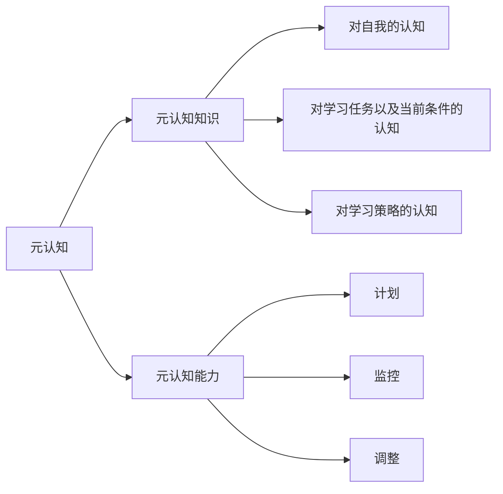

## 学会问问题

- 你的问题是什么？
- 为什么会有这个问题？
- 怎么解决这个问题

## 学习终极三问

- 是什么：只有明确了问题，我们才能知道我们的目标是什么
  - 对知识的定义
    - 弄清楚问题的到底是什么
    - 操作性定义：从具体的行为、特征、指标上对变量的操作进行描述，将抽象的概念转化为可观测、可检验的项目
  - 有价值的是：
    - 当知识和我们的个人体验、思维和情感相印证时体会到的\[知识有用\]的时刻
    - 误区：知识？=知识量，
  - 细化问题
    - 为下一步解决问题提供切实可行的解决目标
  - 回答是什么的问题：理清楚学习内容、明确学习目的和目标
- 怎么办
  - “最优解”从来都是相对于执行者和当时情境条件而言
- 为什么
  - 在探究和分析问题的成因，寻找目的的意义所在，然后才能正确的回答怎么办
  - 直接关系到我们对于“怎么办”的选择
- 什么是有效问题？
  - 目标：想要达到的最终状态是什么
  - 现况：现在已经知道的信息都有什么
  - 策略：接近目标所需的步骤和行动
- 找到问题的本质，不要轻易给自己答案

## 布罗姆分类法-提高效率--知识也要收纳整理

| 知识分类   | 包含亚类                     |
| ---------- | ---------------------------- |
| 事实性知识 | 术语、要素                   |
| 概念性知识 | 结构、分类、原理             |
| 程序性知识 | 技能、算法、使用准则         |
| 元认知知识 | 策略知识、任务知识、自我知识 |

### 元认知知识

#### 元认知知识使我们具备回答：

- 这一主题我知道些什么？
- 我需要多久时间学习这些内容？
- 我预测这个问题的最佳计划是什么？
- 我预测的结果与评估结果的标准是什么？
- 怎么发现犯的错误？
- 我理解自己阅读的东西吗？

### 认知的层次

1. 记忆
   1. 识别
   2. 回忆
2. 理解
   1. 解释
   2. 举例
   3. 分类
   4. 总结
   5. 推理
   6. 比较
   7. 说明
3. 应用
   1. 执行
   2. 运用
4. 分析
   1. 区别
   2. 组织
   3. 归因
5. 评价
   1. 检查
   2. 评论
6. 创造
   1. 产生
   2. 计划
   3. 生产

## 化繁为简-思维过滤法

1. 信息检索的重点
2. 信息的真实性
   1. 权威性
   2. 可靠性
   3. 客观性
   4. 专业性
   5. 专业性
   6. 准确性
   7. 时效性
3. 检索的有效性
   1. 优化检索词
      1. 提词
      2. 关键词限缩范围
   2. 分类搜索
4. 信息评估
   1. 确定目标
      1. 提出问题
         1. 背景知识
         2. 相关概念
         3. 知识结构
   2. 选定策略
      1. 系统化结构式搜索--层次分明
      2. 关联网网络时搜索--顺藤摸瓜
      3. 地毯式搜索--面面俱到
   3. 搜索过程
   4. 信息评估
      1. 一个原则：多次查证
      2. 两个对象：
         1. 信息内容
         2. 信息来源
      3. 六个维度：
         1. 权威性、可靠性、客观性、专业性、准确性、时效性

## 构建笔记知识系统

### 关联性笔记

- 时刻思考知识之间的关联是什么
- 如何将知识运用到实际生活中
- 形式：手写？？？
- 笔记法：
  - 空雨伞笔记法
    - 事实区：what--
    - 解释区：why
    - 行动区：how
  - 笔记流
    - 关键词
    - 概念、知识之间的关系
    - 你的想法、回忆、联系

| 类型     | 关系                   | 表现形式 |
| -------- | ---------------------- | -------- |
| 线性关系 | 因果、影响、时间顺序   | 箭头     |
| 对比关系 | 异同、优劣、评价       | 图标     |
| 层级关系 | 结构层次、概念包含关系 | 树状图   |

### 反思性笔记

- 维度
  - 时间维度
    - 不应该单纯描述做了什么
    - 而应该与自己思考过程进行对话
      - 做的事情或学的知识是什么？
      - 是如何做的
      - 为什么这么做
      - 你对自己做过的事情有什么感受、想法
      - 什么样的资源对我的理解有帮助
      - 这些资源哪里找
      - 你是怎样摸索出入门这个学科的方式的
      - 在这个过程中，你是否改变了自己的看法或者观点
      - 你在未来将如何提升自己的学习思考和工作
  - 项目维度
- 要点
  - 数据化--分类、整理、电子化存档
  - 多复习--定期温习筛选、去伪存真

## 记忆大师

1. 注意
2. 编码
   1. 标记--复述
   2. 造句--理解
   3. 提“是什么类”问题--分析
   4. 提“为什么”类问题---分析
3. 提取
   1. 只能提取部分记忆
   2. 主动学习：多想自己提问
   3. 善用你已有的知识体系，加深新内容和已有知识的联系
   4. 增加提取次数
